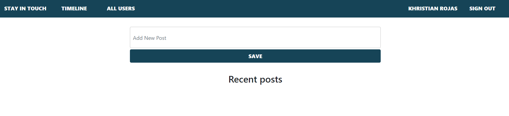

# Scaffold for social media app with Ruby on Rails

> Practice of friendship table in Rails using social media scaffold forked from Microverse.



## Built With

- Ruby v2.7.0
- Ruby on Rails v5.2.4

## Live Demo

[Live version](https://guarded-journey-74632.herokuapp.com)


## Getting Started

To get a local copy up and running follow these simple example steps.

### Prerequisites

Ruby: 2.6.3
Rails: 5.2.3
Postgres: >=9.5

### Setup

Instal gems with:

```
bundle install
```

Setup database with:

```
   rails db:create
   rails db:migrate
```

### Github Actions

To make sure the linters' checks using Github Actions work properly, you should follow the next steps:

1. On your recently forked repo, enable the GitHub Actions in the Actions tab.
2. Create the `feature/branch` and push.
3. Start working on your milestone as usual.
4. Open a PR from the `feature/branch` when your work is done.


### Usage

Start server with:

```
    rails server
```

Open `http://localhost:3000/` in your browser.

### Run tests

```
    rpsec --format documentation
```
### Deployment

TBA

## Authors

👤 **Khristian Rojas**

- Github: [@githubhandle](https://github.com/karmaester)
- Twitter: [@twitterhandle](https://twitter.com/karmaendlich)
- Linkedin: [linkedin](https://www.linkedin.com/in/khristian-rojas/)

👤 **Brian Cruz**

- Github: [@githubhandle](https://github.com/BrianSammit)
- Twitter: [@twitterhandle](https://twitter.com/cruzsammit)
- Linkedin: [linkedin](https://www.linkedin.com/in/brian-sammit-cruz-rodriguez-5877551a8/)


## 🤝 Contributing

Contributions, issues and feature requests are welcome!

Feel free to check the [issues page](issues/).

## Show your support

Give a ⭐️ if you like this project!

## Acknowledgments


- The Odin Project
- Rails guides
- Microverse
- Stand up Team

## 📝 License

This project is [MIT](lic.url) licensed.![]
